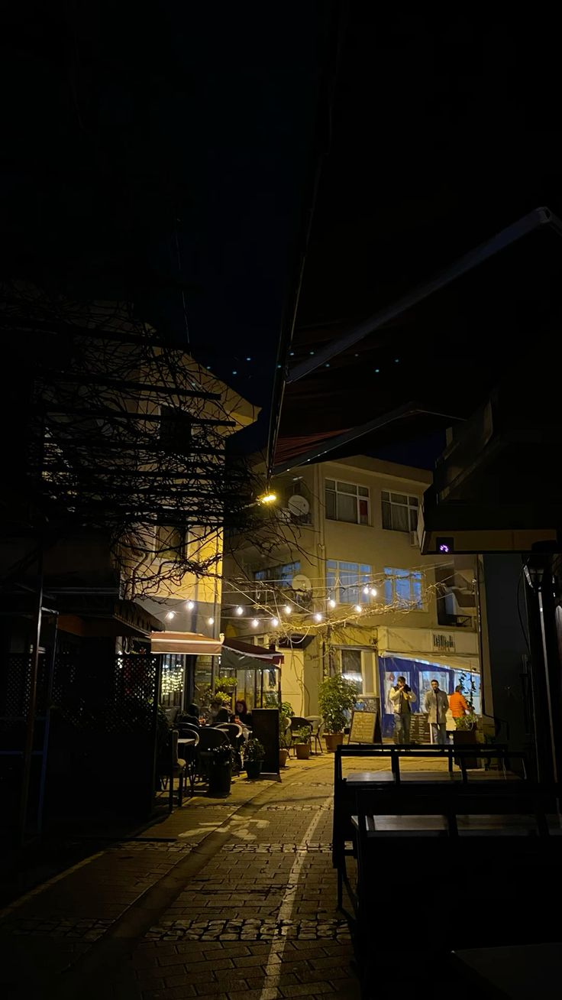

# Çanakkale'de Gece, Götürbilet'le Yolda

## Otobüsün hafif sallantısında başlayan küçük bir kahramanlık hikâyesi
Otobüsün motoru mırıldanırken, koltuğumun arkasındaki küçük ekranın upuzun yol menüsüne bakıp “keşke her şehir bir tatlı gibi gelse” diye düşündüğümü itiraf ediyorum.  
Götürbilet bileti cebimdeydi, bir macera niyetiyle yanımda. Ankara'dan Çanakkale'ye doğru yol alırken kafamda sadece deniz, rüzgâr ve gece sokaklarında kaybolma planı vardı.  
Gözümü kapatıp uyanınca kendimi rıhtımda, denizin tuzlu kokusuyla, köfteci midivanlarının dumanıyla ve kim bilir nereden gelen bir türküyle buldum.  
İşte o an dedim ki: “İyi ki geldim.”

---

## Varış ve ilk dakikalar
Çanakkale gecesi; tuzlu bir hava, ılık rüzgâr ve sahildeki lambaların yansımasıyla başlıyor.  
Adımların taşlı yolda yankılanıyor; denizden gelen hafif bir serinlik yüzünü okşuyor.   

Renkler gece boyunca değişiyor: limanın turuncu ışıkları, kafe vitrinlerinin sıcak sarısı, Bozcaada feribotunun beyazı ve antik taşların ay ışığı altındaki gri tonu...  
Tatlar da öyle: taze balık, sıcak ekmek arası köfte, sığır sucuğu ve yanına küçük bir ayran — her lokma bir hatıra.

---

## Komik bir anekdot — Midivandaki maharet denemesi
Yeni kordonda yürürken bir midivanın önünde durdum.  
“Self servis” yazıyordu; kafamda “nasıl hızlı sipariş veririm” planları…  
Tam menüye bakarken rüzgâr cebimdeki broşürü uçurdu; broşürle yarışan bir güvercin varmış gibi koştum.  
Sonunda broşürü yakaladım ama gören herkes beni midivanın önünde kahkahalarla izledi.  
Garip ama turist gibi hissetmek de güzel — hatta bazen komik hareketler bile en iyi fotoğraf anıdır.

---

## Keşifler — Saklı köşeler ve küçük ödüller
- **Rıhtımın ötesindeki sahil yolu:** Akşam yürüyüşleri için ideal; küçük balıkçı tekneleri ve deniz fenerleri fotoğrafik birer obje.  
- **Troya antik kenti (gündüz kaçamağı önerisi):** Mitlerin ayak izi; taşların arasında dolaşırken kendi epik hikâyeni yazmak isteyebilirsin.  
- **Bozcaada günübirlik turu:** Rüzgârı, şarapları ve dar taş sokaklarıyla tam bir kaçış; feribota erken bin, öğleden sonra limanda gün batımını yakala.  
- **Mahalle kafeleri:** Yerel kahve kültürünü tatmak için küçücük dükkanlara gir, sahipleriyle sohbet et; en iyi ipuçları oralardan gelir.

---

---

## Yerel lezzetler — Ağzında patlayacak öneriler
- **Ekmek arası köfte:** Sıcak, hafif baharatlı; gece yürüyüşünde en iyi arkadaşın.  
- **Taze balık ve mezeler:** Sahil restoranlarında günün taze ürününü sor.  
- **Bozcaada şarapları:** Ada üzümlerinden gelen tatlı bir mola.  
- **Sokak tatlısı:** Özellikle gece yarısı kestanesi, sıcak ve rahatlatıcıdır.

---

## Pratik ipuçları — Seyahatini kolaylaştıracak notlar
1. **Bilet alırken esneklik:** Götürbilet ile erkenden bilet al; ama akşam dönüşünü geç planlayabiliyorsan, gece seferleriyle esnek ol.  
2. **Yanına hafif bir ceket al:** Rüzgâr beklenmedik anlarda gelebilir.  
3. **Nakit + kart dengesi:** Küçük tezgâhlarda nakit daha pratik olabilir.  
4. **Erken feribot bileti:** Bozcaada için sabah erken feribotu tercih et; ada daha sakin oluyor.  
5. **Yürüyerek keşfet:** Dar sokaklar ve küçük meydanlar yürürken en çok sürpriz çıkar.  
6. **Gece fotoğraf ipucu:** Ay ışığı altında taş sokaklarda uzun pozlama dene — telefon stabil tutucuyla harika kareler yakalarsın.

---

## Kültürel içgörüler — Saygıyla, merakla
Çanakkale hem gençlerin hem de tarih meraklılarının buluştuğu bir yer.  
Konuşurken, mekân sahipleriyle küçük yerel hikâyeler paylaşmak, sana kapıları açar.  
Yerel yaşamın ritmini anlamak için sabah pazarı ziyaret et — sebzeler, peynirler, taze ekmek ve tezgâh sohbetleri orada başlar.

---

## Sonuç — Bir gece, bir çanta ve bir sürü anı
Çanakkale bana kısa bir gece yolculuğunda hem dinginlik hem de canlılık verdi.  
Götürbilet ile başlayan yolculuk, sokak lezzetleri, komik küçük aksilikler ve sahildeki sohbetlerle zenginleşti.  
Eğer sen de “anlık kaçamak” seviyorsan, valizini hafif tut: bir ceket, bol iştah ve merak yeter.

---

Götürbilet ile bir sonraki macerana atıl: **Hızlı, güvenli ve kolay — trip with götürbilet.**  
Biletini al, koltuğuna yerleş, dünyanın küçük sürprizlerine açık ol.